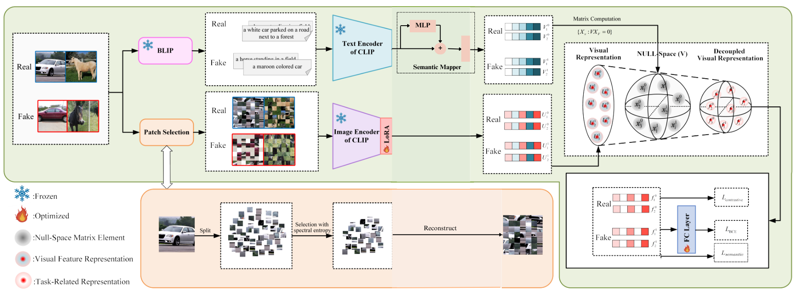

# AdvancedN NS-Net: Improving Generalizable AI Generated Image Detection via Learned Semantic Null-Space Projections
This repository provides an improved and extensible implementation of [NS-Net (Yan et al. 2025)](https://www.arxiv.org/abs/2508.01248).
AI-generated images produced by GANs and diffusion models have become nearly indistinguishable from real photographs. Traditional supervised detectors fail to generalize to unseen generation models.
NS-Net (Null Space Network) showed that:
> Semantic information in CLIP embeddings suppresses artifact cues — and these semantic components must be removed.
Advanced NS-NET improves the original model and provides a powerful approach for detecting AI-generated images by removing semantic information from CLIP embeddings using NULL-space projection. Due to the unavailability of the codebase for NS-Net, we replicated it and compared it with our implemented Advanced NS-Net.

## Advanced NS-Net Architecture

For details regarding the architecture viewers can refer to our [paper](https://github.com/NeelRambhia/Advanced-NSNet/blob/main/Advanced%20NS-Net_%20Improving%20Generalizable%20AI-Generated%20Image%20Detection%20via%20Learned%20Semantic%20Null-Space%20Projections.pdf) or [presentation](https://github.com/NeelRambhia/Advanced-NSNet/blob/main/Advanced%20NS-Net%20Presentation.pdf).

## Contents of the Repositiory
- Implementation of the original NS-NET model ('src'->'Original_NSNET.ipynb')
- Implementation of our Advanced NS-NET model ('src'->'Advanced_NSNET.ipynb')
- Project Report cum Paper on Advanced NS-NET
- Presentation slides on Advanced NS-NET
- Architecture of Advanced NS-NET

The codes can be found in the 'src folder'. **Note, incase Github is not able to render/ display the '.ipynb' files correctly, you may download and view the files or visit [here](https://drive.google.com/drive/folders/1bya_53c6WqoqMBJ0ao3cdob5xer7OLD1?usp=sharing) to open them on Google Colab.**
